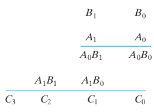
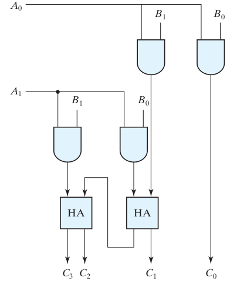
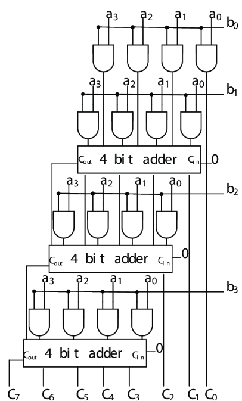
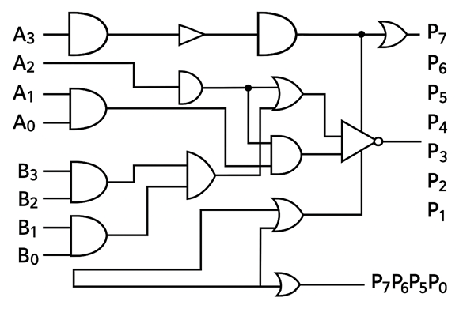
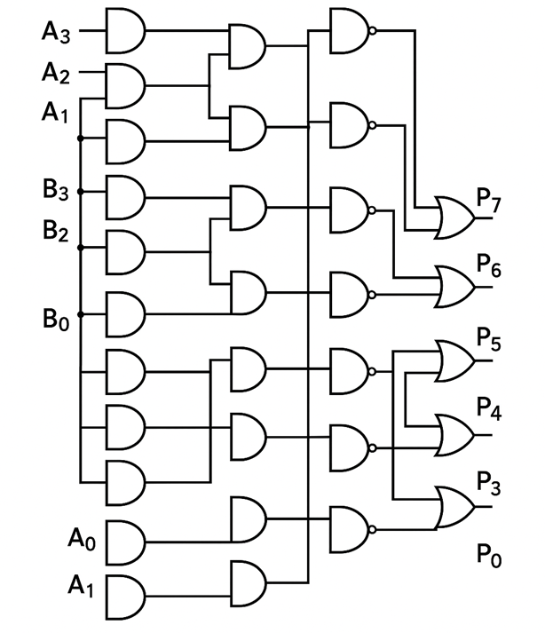

### Binary Multiplication Fundamentals

Binary numbers can be multiplied using the same principles as decimal multiplication. The process involves generating partial products by multiplying the multiplicand by each bit of the multiplier, then summing these partial products to obtain the final result. This forms the foundation for all digital multiplier circuits used in modern processors, digital signal processors (DSPs), and specialized arithmetic units.

#### Basic Multiplication Process

**Step 1**: Start with the least significant bit of the multiplier

**Step 2**: Generate partial products by multiplying the multiplicand with each multiplier bit

**Step 3**: Shift each partial product one position to the left relative to the previous one

**Step 4**: Add all partial products to obtain the final result

#### Classification of Digital Multipliers

Digital multipliers can be categorized based on their implementation approach and optimization goals:

**Array Multipliers**:

- Simple structure using AND gates and adders arranged in a rectangular array
- Predictable timing and straightforward implementation
- Used in basic microcontrollers and educational applications

**Tree Multipliers**:

- More efficient designs like Wallace tree and Dadda multipliers that reduce delay
- Parallel processing of partial products for high-speed applications
- Commonly found in high-performance processors and graphics units

**Sequential Multipliers**:

- Booth's algorithm and modified Booth algorithm for signed multiplication
- Reduced hardware complexity with iterative processing
- Ideal for area-constrained implementations

**Advanced Multipliers**:

- Specialized designs with optimization techniques
- Custom logic configurations for specific applications
- Demonstrate various trade-offs in digital circuit design

### 2-Bit Binary Multiplier

A 2-bit multiplier demonstrates the fundamental concepts of digital multiplication. Consider two 2-bit binary numbers: multiplicand B₁B₀ and multiplier A₁A₀, producing a 4-bit product C₃C₂C₁C₀.

#### Circuit Implementation

The multiplication B₁B₀ × A₁A₀ generates two partial products:

**First Partial Product**: B₁B₀ × A₀

**Second Partial Product**: B₁B₀ × A₁ (shifted left by one position)

Since multiplication of two binary bits results in 1 only when both bits are 1, AND gates are used to generate the partial products. The partial products are then added using half-adder circuits.

#### Logic Equations

**Partial Products**:

- P₀₀ = B₀ · A₀
- P₀₁ = B₁ · A₀
- P₁₀ = B₀ · A₁
- P₁₁ = B₁ · A₁

**Final Product**:

- C₀ = P₀₀
- C₁ = Sum output of HA₁ (P₀₁ + P₁₀)
- C₂ = Sum output of HA₂ (Carry from HA₁ + P₁₁)
- C₃ = Carry output of HA₂

#### Key Features

- Uses 4 AND gates for partial product generation
- Employs 2 half-adders for partial product summation
- Simple and educational design
- Foundation for larger multiplier circuits
- Demonstrates basic multiplication principles

Circuit Diagram for 2-bit multiplier using half adders and AND gates

### 4-Bit Array Multiplier

The 4-bit array multiplier extends the 2-bit concept to handle larger numbers. It can multiply two 4-bit binary numbers (maximum value 15 each) to produce an 8-bit product (maximum value 255).

#### Circuit Architecture

**Inputs**: Multiplicand A₃A₂A₁A₀ and Multiplier B₃B₂B₁B₀

**Output**: 8-bit Product P₇P₆P₅P₄P₃P₂P₁P₀

The circuit generates 4 partial products, each requiring proper alignment and summation.

#### Partial Products Structure

- **Row 0**: A₃B₀, A₂B₀, A₁B₀, A₀B₀
- **Row 1**: A₃B₁, A₂B₁, A₁B₁, A₀B₁ (shifted left by 1)
- **Row 2**: A₃B₂, A₂B₂, A₁B₂, A₀B₂ (shifted left by 2)
- **Row 3**: A₃B₃, A₂B₃, A₁B₃, A₀B₃ (shifted left by 3)

#### Important Design Considerations

**Carry Propagation**: The carry outputs (Cout) from the first two 4-bit adders must be properly connected to the carry inputs (Cin) of the subsequent adders to ensure correct addition of all partial products.

**Adder Selection**: While 4-bit full adders can be used, implementing with individual single-bit adders (half-adders and full-adders) provides better understanding of the circuit operation and more efficient hardware utilization.

#### Logic Implementation

- **16 AND gates** for partial product generation (4×4 matrix)
- **Multiple adder stages** for partial product summation
- **Systematic carry propagation** between adder stages
- **Optimized critical path** for timing performance

#### Applications

- **Embedded processors**: Basic arithmetic operations
- **Digital signal processing**: Convolution and filtering
- **Microcontrollers**: Mathematical computations
- **FPGA implementations**: Custom arithmetic units

### Sequential Shift-and-Add Multiplier

The shift-and-add algorithm implements multiplication using a sequential approach, similar to manual binary multiplication. This method is particularly useful when hardware resources are limited or when implementing multiplication in software.

#### Algorithm Description

**Initialization**:

- Load multiplicand and multiplier into registers
- Clear the product accumulator
- Set bit counter to the multiplier width

**Iterative Process**:

1. **Examine LSB** of multiplier
2. **If LSB = 1**: Add multiplicand to partial product
3. **If LSB = 0**: No addition required
4. **Shift** multiplicand left by one position
5. **Shift** multiplier right by one position
6. **Decrement** bit counter
7. **Repeat** until all bits are processed

#### Control Flow Structure

**Start** → **Initialize Registers** → **Check Multiplier LSB** → **Conditional Add** → **Shift Operations** → **Counter Check** → **Result Output**

#### Key Features

- **Sequential processing**: One bit per clock cycle
- **Resource efficient**: Requires only one adder
- **Flexible implementation**: Suitable for various bit widths
- **Clear algorithm**: Easy to understand and implement
- **Software friendly**: Can be implemented in microprocessors

#### Advantages and Disadvantages

**Advantages**:

- Minimal hardware requirements
- Scalable to any bit width
- Easy to control and debug
- Lower power consumption

**Disadvantages**:

- Slower than parallel methods
- Requires multiple clock cycles
- Not suitable for high-speed applications
- More complex control logic

#### Applications

- **Microcontroller implementations**: Resource-constrained systems
- **Software multiplication**: Processor algorithms
- **Educational purposes**: Understanding multiplication concepts
- **Low-power designs**: Battery-operated devices

### Advanced Multiplier Architectures

#### 4-Bit Advanced Multiplier

The 4-bit advanced multiplier builds upon the basic array multiplier concept while incorporating optimization techniques and additional logic gates for improved performance and educational value.

**Key Features**:

- **Enhanced gate library**: Utilizes NOT, XOR, and OR gates alongside basic AND gates
- **Optimization opportunities**: Students can explore different implementation strategies
- **Signal inversion**: NOT gates enable advanced logic optimizations
- **Custom adder configurations**: XOR and OR gates allow for alternative adder implementations

**Design Principles**:

- **Partial product generation**: Same 16 AND gates as array multiplier
- **Flexible addition network**: Multiple gate types enable various summation strategies
- **Logic optimization**: Students can implement area or speed optimizations
- **Educational focus**: Demonstrates impact of gate selection on circuit characteristics

**Optimization Strategies**:

- **Gate substitution**: Replace compound logic with simpler gate combinations
- **Signal conditioning**: Use NOT gates for active-low logic interfaces
- **Custom carry logic**: Implement specialized carry generation using XOR/OR gates
- **Area-speed trade-offs**: Balance between hardware complexity and performance

#### Wallace Tree Multiplier

Wallace tree multipliers represent a significant advancement in high-speed multiplication, utilizing a tree structure to minimize the critical path delay through parallel processing of partial products.

**Algorithm Description**:

The Wallace tree algorithm systematically reduces partial products using a series of compression stages:

**Stage 1**: Group partial products into sets of three
**Stage 2**: Use Full Adders (3:2 compressors) to reduce each group of three to two
**Stage 3**: Group remaining pairs with Half Adders (2:2 compressors)  
**Stage 4**: Repeat until only two operands remain
**Stage 5**: Add final two operands with fast adder

**Tree Structure Benefits**:

- **Parallel processing**: Multiple partial products processed simultaneously
- **Reduced delay**: Logarithmic depth instead of linear accumulation
- **Scalability**: Efficient for large bit-width multiplications
- **High throughput**: Optimal for high-frequency applications

**Implementation Details**:

- **3:2 Compression**: Full adders reduce three partial product bits to sum and carry
- **2:2 Compression**: Half adders handle pairs of partial product bits
- **Carry-save addition**: Intermediate results maintain separate sum and carry
- **Final addition**: Fast carry-propagate adder completes the multiplication

**Design Considerations**:

- **Tree depth**: Determines critical path delay (typically log₁.₅(n) stages)
- **Hardware complexity**: More complex than array multipliers but faster
- **Routing complexity**: Irregular structure requires careful layout planning
- **Power consumption**: Higher due to increased switching activity

#### Booth's Algorithm

Booth's algorithm provides an efficient method for signed binary multiplication by examining groups of multiplier bits and performing conditional operations based on bit patterns.

**Algorithm Principles**:

Booth's algorithm is based on the observation that multiplication by a sequence of 1's can be replaced by subtraction and addition operations:

**Bit Pattern Analysis**:

- **00 or 11**: No operation required
- **01**: Add multiplicand to partial product
- **10**: Subtract multiplicand from partial product

**Sign Extension**: Proper handling of negative numbers using two's complement arithmetic

**Radix-2 Booth Algorithm**:

1. **Initialize**: Set partial product to 0, extend multiplier with additional bit (0)
2. **Examine**: Look at current and previous multiplier bits
3. **Conditional Operation**:
   - 01: Add multiplicand
   - 10: Subtract multiplicand
   - 00/11: No operation
4. **Shift**: Arithmetic right shift of partial product and multiplier
5. **Repeat**: Continue for all multiplier bits

**Modified Booth Algorithm (Radix-4)**:

The modified Booth algorithm examines two bits at a time, reducing the number of partial products by half:

**Bit Pattern Operations**:

- **000, 111**: 0 × multiplicand
- **001, 010**: +1 × multiplicand
- **011**: +2 × multiplicand
- **100**: -2 × multiplicand
- **101, 110**: -1 × multiplicand

**Advantages**:

- **Reduced partial products**: Half the number compared to standard multiplication
- **Signed arithmetic**: Native support for negative numbers
- **Regular structure**: Suitable for parallel implementation
- **Processor friendly**: Widely used in commercial processors

**Applications**:

- **Microprocessor ALUs**: Standard implementation in modern CPUs
- **DSP processors**: Essential for signal processing applications
- **Embedded systems**: Efficient signed multiplication in resource-constrained environments
- **FPGA implementations**: Regular structure suitable for FPGA architectures

### Design Considerations

#### Timing Analysis

- **Critical Path**: The longest delay path determines the maximum operating frequency
- **Carry Propagation**: Dominant factor in array multiplier timing
- **Tree Depth**: Key parameter in Wallace tree multiplier performance

#### Power Optimization

- **Clock Gating**: Disable unused circuit portions
- **Voltage Scaling**: Reduce supply voltage for lower power
- **Architecture Selection**: Choose appropriate multiplier type for power requirements

#### Area-Time Trade-offs

- **Parallel vs. Sequential**: Balance between speed and hardware cost
- **Bit Width Considerations**: Larger multipliers require exponentially more resources
- **Application Requirements**: Match multiplier design to system needs

### Real-World Applications

#### Processor Arithmetic Logic Units (ALUs)

Modern microprocessors incorporate sophisticated multiplier units as core components of their ALUs. These multipliers handle:

- **Integer multiplication**: Basic arithmetic operations for software execution
- **Address calculation**: Memory addressing and pointer arithmetic
- **Loop counters**: Efficient iteration control in software loops
- **Mathematical libraries**: Foundation for complex mathematical functions

#### Digital Signal Processing (DSP)

DSP applications heavily rely on multiplication operations for:

- **Convolution**: Core operation in digital filtering and signal processing
- **FFT algorithms**: Fast Fourier Transform implementations for frequency analysis
- **Image processing**: Pixel manipulation, filtering, and enhancement operations
- **Audio processing**: Digital audio effects, compression, and synthesis

#### Graphics Processing Units (GPUs)

GPU architectures incorporate thousands of multiplier units for:

- **3D graphics rendering**: Matrix transformations and geometric calculations
- **Shader processing**: Pixel and vertex shader arithmetic operations
- **Machine learning**: Neural network training and inference acceleration
- **Parallel computing**: High-throughput scientific and engineering computations

#### Cryptography and Security

Multipliers play crucial roles in cryptographic systems:

- **RSA encryption**: Large integer multiplication for public-key cryptography
- **Elliptic curve cryptography**: Field multiplication operations
- **Hash functions**: Cryptographic hash computation algorithms
- **Digital signatures**: Authentication and integrity verification systems

#### Machine Learning and AI

Modern AI accelerators depend on efficient multiplication:

- **Neural network training**: Backpropagation and weight update calculations
- **Matrix operations**: Core linear algebra operations in deep learning
- **Inference engines**: Real-time AI inference in edge devices
- **Tensor processing**: High-dimensional array operations in AI frameworks

#### Communication Systems

Digital communication relies on multipliers for:

- **Modulation/Demodulation**: Signal processing in wireless communication
- **Error correction**: Reed-Solomon and other error correction algorithms
- **Channel coding**: Forward error correction and signal enhancement
- **Protocol processing**: Network packet processing and routing calculations
