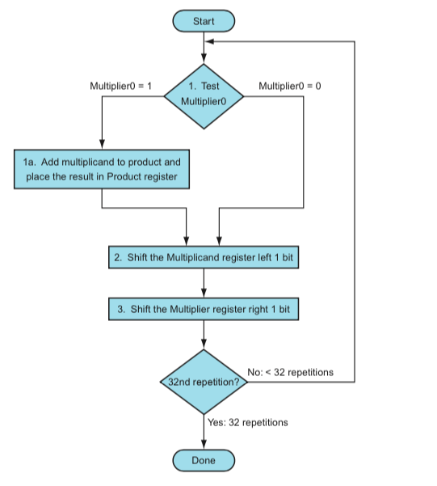

**Binary Multiplier**

Binary numbers can be multiplied in the same way that decimal numbers can be multiplied. Starting with the least significant bit, the multiplicand is multiplied by each bit of the multiplier. Each of these multiplications yields a partial result. Partially successful products are moved one slot to the left. The total of the partial products yields the final product.

**2 Bit Multiplier**
Consider the multiplication of two 2-bit values in the following image to illustrate how a binary multiplier can be constructed with a combinational circuit. B1 and B0 are the multiplicand bits, A1 and A0 are the multiplier bits, and C3 C2 C1 C0 is the product. Multiplying B1 B0 by A0 yields the first partial product. When two bits, such as A0 and B0, are multiplied, the result is a 1 if both bits are 1; otherwise, the result is a 0. This is the same as the AND operation. As a result, AND gates can be used to implement the partial product, as illustrated in the diagram. Multiplying B1 B0 by A1 and shifting one position to the left yields the second partial product. The two partial products are added with two half-adder (HA) circuits.

Circuit Diagram for 2 bit multiplier using half adders and AND gates

**4 Bit Multiplier**

Using this multiplier we can multiply two 4 bit binary numbers as a result we can obtain maximum product as 225, i.e. 15 × 15. 15 is the maximum value of either multiplicand or multiplier.

Suppose multiplicand A3  A2  A1  A0 & multiplier B3  B2  B1  B0 & product as P7  P6  P5  P4  P3  P2  P1 P0 for 4×4 multiplier.

In 4×4 multiplier, there are 4 partial products and we need to add these partial products to get the product of multiplier.

4-bit full adders or single-bit adders can be used to combine them (half-adder & full-adder). When compared to 4-bit full adders, the design of single bit adders is extremely difficult. 

**Shift Multiplier**

This algorithm is similar to how we do multiplication with pen and paper, this is used in computers where it is difficult to design a circuit for 32 bits multiplication, that is why for this task we use shift and add multiplier.
It solves program recursively, by taking the bits from the LSB and moving towards MSB.

